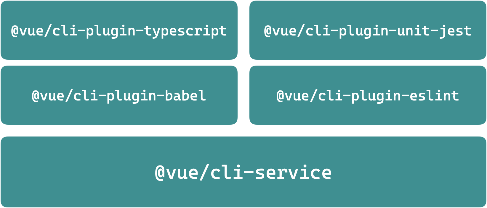
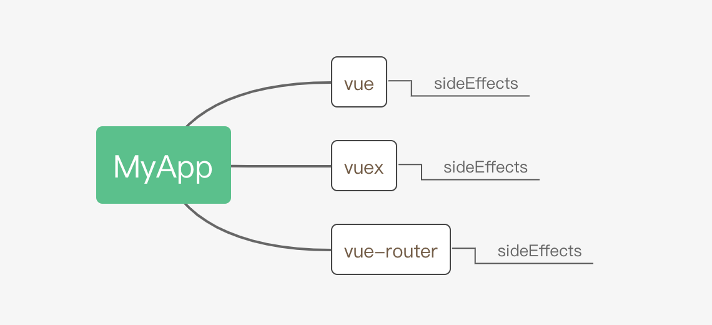

# Part 2 · 模块二相关问题答疑

## 1、Webpack 优化策略，如 vue-cli 是怎么使用的

前提：你需要知道 vue-cli 的设计思想。

vue-cli 核心设计思想**插件机制**：



- `@vue/cli-service` - 封装了 Webpack，定义了一些公共的配置，提供对外修改配置的 API。
- `@vue/cli-plugin-<xxxx>` - 根据特定需要单独通过 `@vue/cli-service` 提供的 API 为 Webpack 添加额外的配置。

所以 vue-cli 中对于 Webpack 的配置并不是写死的，而是动态创建出来的，除了 `@vue/cli-service` 中定义的公共配置，还会有使用到的插件中添加的配置，以及用户通过 `vue.config.js` 中动态添加的配置。

思路：想要知道 vue-cli 中在 Webpack 上实用了哪些优化配置或者插件，最重要的就是得知道 vue-cli 中最终生成的 Webpack 配置是怎样的。

方法：`@vue/cli-service` 中除了 `serve`、`build`、`lint` 这些常见的命令，还额外提供了一个 `inspect` 命令，可以用于将最终的 Webpack 配置打印出来。

```shell
$ npx vue-cli-service inspect
```

详细参考：https://cli.vuejs.org/zh/guide/webpack.html#%E5%AE%A1%E6%9F%A5%E9%A1%B9%E7%9B%AE%E7%9A%84-webpack-%E9%85%8D%E7%BD%AE

关于 SplitChunks：http://www.tensweets.com/article/5ca1898f362e5434baf6336b

## 2、Webpack 魔法注释之间的区别

Webpack 的魔法注释并不存在类似功能的情况，自然也就没有对比。每个魔法注释的作用都是不同的。

```javascript
/* webpackInclude: /\.json$/ */
/* webpackExclude: /\.noimport\.json$/ */
/* webpackChunkName: "my-chunk-name" */
/* webpackMode: "lazy" */
/* webpackPrefetch: true */
/* webpackPreload: true */
```

- https://webpack.js.org/api/module-methods/#magic-comments
- https://webpack.docschina.org/api/module-methods/#magic-comments


## 3、作业题希望能讲解下 Webpack 打包 vue 的过程具体怎么操作

安排上 😄

## 4、想听下自动化测试自动化部署相关内容

自动化测试和自动化部署后面都已经安排上了，第三阶段就开始了

P.S. 上次介绍的 CAZ 中有完整的自动化测试（单元测试）

## 5、Webpack 的 hasApiFallback 配置是什么原理，如何实现的

应该说的是 history-api-fallback 特性。

首先，这是 webpack-dev-server 的一个特性，其作用就是让我们开发阶段所调试的应用支持 HTML5 的 HistoryAPI。

关于 HistoryAPI，这其实是我们在开发现代化 SPA 应用时经常会考虑的一种方式，与之对应的就是最常见的 Hash 模式，例如 https://zce.me/#/about、https://zce.me/#/contact，如果实用 History 模式，则 URL 地址：https://zce.me/about、https://zce.me/contact

这个点本身其实跟 Webpack 并没有任何关系。只要我们的 SPA 应用中使用的是 History 模式，都需要这个特性。

很多时候我们前端应用都是在 Nginx 中适配这个用法：

```nginx
server {
  # other config...
  location / {
    try_files $uri $uri/ /index.html;
  }
}
```

其核心原理就是在服务端路由阶段，如果没有找到客户端所请求的文件，自动返回 index.html。

如果用一个 Node.js 应用实现，核心实现：

```javascript
const path = require('path')
const express = require('express')
const app = express()

// 先走 static 中间件，如果能找到存在的静态文件
app.use(express.static(path.join(__dirname, 'public')))

// 找不到统一 fallback 到 index.html 文件
app.use((req, res) => {
  res.sendFile(path.join(__dirname, 'public/index.html'))
})

app.listen(3000)
```

webpack-dev-server 中的 history-api-fallback 使用的是 https://github.com/bripkens/connect-history-api-fallback。

## 6、Tree-shaking 与 sideEffects 的区别，sideEffects 是打包 Tree-sharking 时用到的，为什么是在 package.json 文件中配置而不是在 webpack.config.js 文件中配置

Tree Shaking 是移除未引用代码，sideEffects 只是标记一个模块有没有副作用，二者并没有直接的关系，也不是因果关系。

至于为什么不是放到 webpack.config.js 中配置 sideEffects，原因很简单 sideEffects 只是标记当前模块有没有副作用，当前模块并不一定用了 Webpack。

sideEffects 只是一个标志而已，并没有实际的功能，只不过有些工具会根据一个模块是否有这个标志来去决定是否要做一些事情。



## 7、Webpack 一些配置的讲解, 还有一些插件 API 也变化了

截止目前，html-loader 和 copy-webpack-plugin 的 API 发生了一些改动，这些内容参考一些相关的 changelog 就可以了。

核心还是掌握思路，理解才能应对变化。单靠记忆解决不了任何问题

## 8、想让老师分享下关于 Webpack 在面试中的一些问题


## 9、怎么解决 Webpack 中使用 babel-loader 无法 Tree-shacking

https://kaiwu.lagou.com/xunlianying/index.html?courseId=17#/detail?weekId=743&lessonId=2859

## 10、Webpack 当中 historyApiFallback 配置的实现原理

同第五个问题

## 11、总结对比一下 Webpack、Rollup、Gulp、Grunt

首先，这四者并不适合放在一起横行比较，以 Webpack 和 Gulp 为例，他们的定位并不一样

- Gulp 不具备任何具体功能，完全自主，自定义性强
  - Tasks Runner
  - 需要开发者自己实现各种功能
  - 对 Node.js 储备要求高
  - 强调任务的概念，Gulp 本身实际上是一个任务调度工具（tasks runner）
  - 通俗点说：Gulp 就是你想干什么就干什么～
- Webpack 从模块打包出发，通过插件实现一部分 Web 项目的自动化任务
  - 模块化打包功能开箱即用，相对门槛更低
  - 主要应对 SPA 类应用的模块打包

因为近几年 Webpack 的插件生态很好，

以往我们使用 Gulp 去实现的常用自动化工作现在都可以使用 Webpack 配合插件实现

让开发者产生二者「类似」这个误会的原因：Webpack 一直在突破边界。

### Gulp 常见场景

- 如果只是传统的静态页面开发（多页应用），注重的是页面结构与样式，建议采用 Gulp
- 小程序项目中使用 Sass / Less / TS，Gulp
- 再者就是日常的综合事务：文件重命名 / 前后缀
- 可以取代：批处理/shell

### 最佳实践

- 工具层面没有唯一标准答案
- 充分掌握 Gulp 与 Webpack，因地制宜
- SPA 类使用 Webpack
- MPA 类使用 Gulp
- 如果只是个别的需求直接使用 npm scripts 配合个别工具就好
  - 例如：只需要校验代码，单独使用 ESLint 的 CLI 就可以
  - npm scripts 就是小型 tasks runner

## 12、Vue 和 React 官方脚手架在初始化后自动下载依赖是如何实现的

参考上次直播介绍的 CAZ 工具。

核心思路就是通过代码调用 child_process 模块，自动执行 npm install 或者 yarn add 命令。

https://github.com/zce/caz/blob/1a1b1ada7420be4360f67e9d119b49259f0ff750/src/init/install.ts#L24-L28

## 13、如果想把 Webpack 封装成上次 gulp 那种 npm 包，并且 webpack.config.js 里面的配置根据需要动态生成要怎么搞

Webpack 提供了可编程的 API，如果想要通过自己写一个 npm 模块将 Webpack 包起来其实会更加简单。

https://webpack.js.org/api/node/

```javascript
#!/usr/bin/env node

const webpack = require('webpack')
const config = require('..')

webpack(config, (err, stats) => { // Stats Object
  if (err || stats.hasErrors()) {
    console.log(err)
    console.log(stats)
  }
  console.log('bundle...')
})
```

```javascript
/** @type {import('webpack').Configuration} */
module.exports = {
  entry: './src/main.js',
  output: {
    filename: 'bundle.js'
  },
  module: {
    rules: [
      {
        test: /\.css$/,
        use: [
          require.resolve('style-loader'),
          require.resolve('css-loader')
        ]
      }
    ]
  }
}
```

## 14、扩展下自动化测试或者前端单元测试

自动化测试和自动化部署后面都已经安排上了，第三阶段就开始了

P.S. 上次介绍的 CAZ 中有完整的自动化测试（单元测试）

## 15、Webpack 中 compiler 和 compilation 区别

Compiler 是编译器对象，Compilation 可以理解为一次构建过程中的上下文对象，里面包含了这次构建中全部的资源和信息。

一句话总结：Webpack 每次工作就是先创建一个用于编译的编译器对象，这个对象维护整个 Webpack 打包的工作过程，在编译器编译的一开始就会创建一个 Compilation 对象，用于记录这次工作过程中产生的资源。

有点类似于我在 [zce/caz](https://github.com/zce/caz) 项目中的 creator 对象跟 context 对象的关系。

## 16、Webpack 打包第三方包成 vendor，如果第三方依赖打包过后的 vendor 体积过大，这个怎么优化嘞

两种思路：

1. `optimization.splitChunks.cacheGroups` 单独拆包
2. `externals`

推荐使用 `externals` 配合 CDN 链接

1. 构建速度更快，
2. Web 应用本就应该使用 CDN

## 17、Webpack 中怎么优化构建速度

- thread-loader：https://github.com/webpack-contrib/thread-loader
- cache-loader

## 18、希望在后面的课程中能将前面学的用起来。例如用 ts 去实现 vue-router
